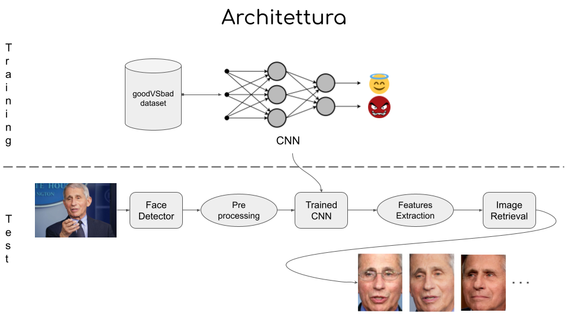

# Face_good_vs_bad

## Project Description
The project consist in a Telegram Bot that, given an image, it will tell if you are good or bad based on different descriptors, moreover, it will retrieve most similar images, and let you iteratively refine the research!

You only need to run run.py file and enjoy!

## General Architecture

## About
Project for 2021/2022 Visual Information Processing and Management course, master degree in Computer Science, Milano Bicocca.

Development team:
* Gherardi Alessandro, 817084
* Locatelli Simone Giuseppe, 816781
